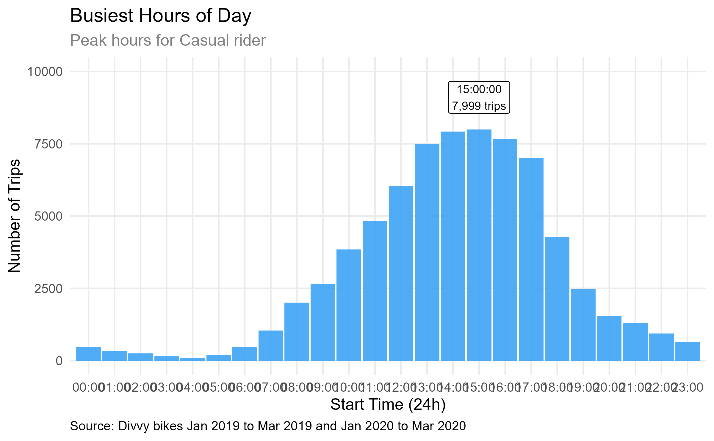

## Objectives

The goal of this analysis was to identify how annual members and casual
riders use the Cyclistic bike-share system differently. By understanding
these behaviors, we aim to design a marketing strategy to convert casual
riders into long-term, profitable annual members.

## Key Findings

-   **Ride Frequency:** Casual riders peak on weekends, while members
    show high activity during weekday commuting hours (8 AM and 5 PM).

-   **Ride Duration:** Casual riders have an average trip duration
    nearly twice longer than members.

-   **Afternoon Surge:** Casual ridership peaks at **3:00 PM**, with the
    highest sustained traffic occurring between **12:00 PM and 5:00
    PM**.

## Recommendations

1.  **Introduce Weekend Subscriptions for Casual Riders**

    Leverage the **Weekly Trips Summary by Customer Type** graph, which
    shows higher bike usage by casual riders on weekends. Offer targeted
    weekend-only membership plans to convert casual riders into
    recurring members, emphasizing convenience and cost savings for
    weekend rides.

2.  **Targeted Advertising at High-Traffic Stations for Casual Riders**

    Based on the **Top 5 Most Busiest Stations by Casual Rider** graph,
    prioritize advertising at stations with the highest casual rider
    traffic. Promote membership upgrades or special offers, highlighting
    benefits like unlimited rides or discounts tailored to frequent
    casual riders.

3.  **Launch Midday Promotions for Peak Hours**

    The **Busiest Hours of Day** graph indicates peak bike usage by
    casual riders between 12 PM and 5 PM. Introduce time-specific
    promotions, such as discounted rates or bonus ride time for trips
    taken during these hours.

## Conclution

Casual riders and annual members use Cyclistic for very different
reasons. While members use the bikes for daily commuting, casual riders
mainly use them for leisure in the afternoons and on weekends. To grow
our membership, we should focus our marketing on these high-traffic
afternoon windows, showing casual riders how much they could save by
switching to an annual plan.
