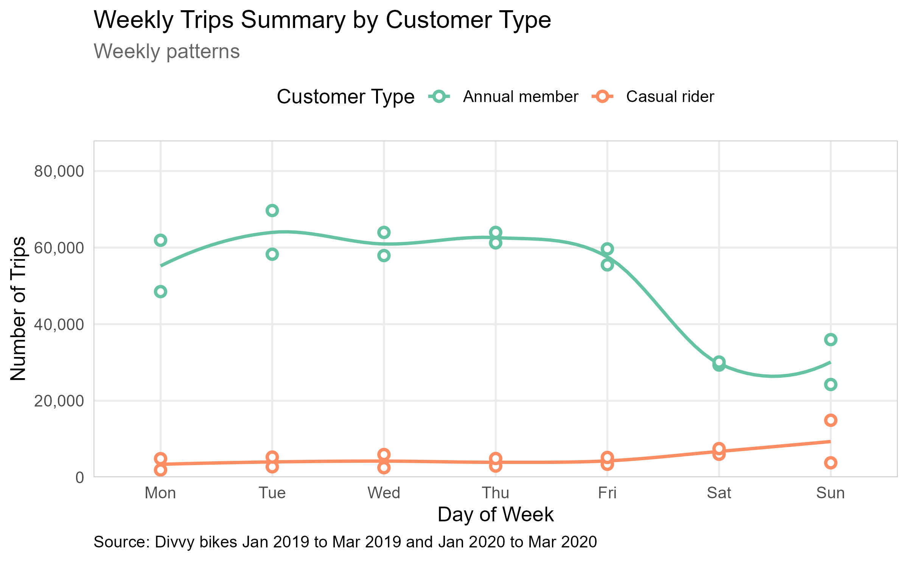
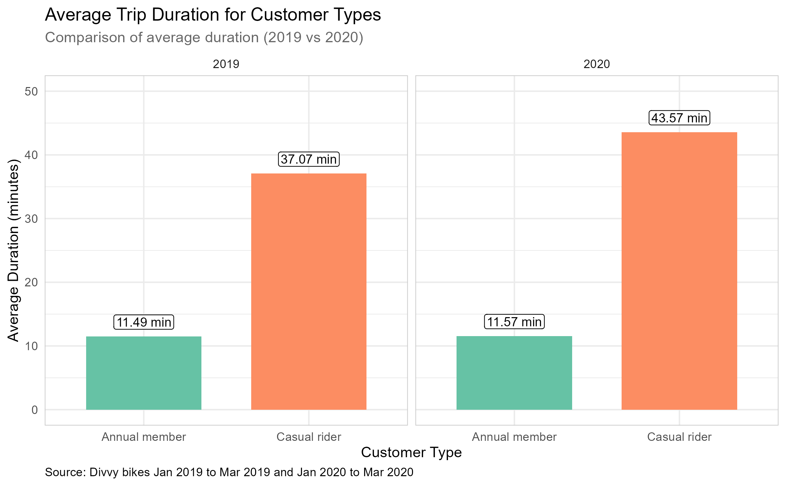

# Cyclistic Bike-Share Analysis Case Study

## Overview

This repository contains my analysis of the Cyclistic bike-share program
data, a fictional company in Chicago. This project is part of the
**Google Data Analytics Professional Certificate** capstone.

## Business Task

Analyze historical trip data to understand how **annual members** and
**casual riders** use Cyclistic bikes differently. The goal is to
provide data-driven recommendations to convert casual riders into annual
members.

## Data Source & Tools

-   **Data Source:** [Link to Divvy Trip
    Data](https://divvy-tripdata.s3.amazonaws.com/index.html) (Provided
    by Motivate International Inc.)
-   **Tools Used:** \* **R** (Data Cleaning, Transformation, and
    Visualization)
    -   **Key Libraries:** `tidyverse`, `lubridate`, `ggplot2`, `dyplr`,
        `hms`, `scales`.

## 5. Folder Structure

-   `01_Data/`: Contain folders for (`Raw/`) and (`Processed/`) CSV
    files.
-   `02_Code/`: R scripts for cleaning (`01_Processing.R`), analysis
    (`02_Analysis.R`) and visualizations (`03_Visualizations.R`).
-   `03_Outputs/`: Contain folders for (`Graphs/`) (PNG) and
    (`Reports/`).

## Key Findings

-   **Ride Frequency:** Casual riders peak on weekends, while members
    show high activity during weekday commuting hours (8 AM and 5 PM).

-   **Ride Duration:** Casual riders have an average trip duration
    more than twice longer than members.

-   **Afternoon Surge:** Casual ridership peaks at **3:00 PM**, with the
    highest sustained traffic occurring between **12:00 PM and 5:00
    PM**.

## Recommendations

1.  **Introduce Weekend Subscriptions for Casual Riders**

    Leverage the **Weekly Trips Summary by Customer Type** graph, which
    shows higher bike usage by casual riders on weekends. Offer targeted
    weekend-only membership plans to convert casual riders into
    recurring members, emphasizing convenience and cost savings for
    weekend rides.

2.  **Targeted Advertising at High-Traffic Stations for Casual Riders**

    Based on the **Top 5 Most Busiest Stations by Casual Rider** graph,
    prioritize advertising at stations with the highest casual rider
    traffic. Promote membership upgrades or special offers, highlighting
    benefits like unlimited rides or discounts tailored to frequent
    casual riders.

3.  **Launch Midday Promotions for Peak Hours**

    The **Busiest Hours of Day** graph indicates peak bike usage by
    casual riders between 12 PM and 5 PM. Introduce time-specific
    promotions, such as discounted rates or bonus ride time for trips
    taken during these hours.

## How to Run the Code

1.  Clone this repository.
2.  Open \`Cyclistic.Rproj\` in RStudio.
3.  Run the scripts in the \`02_Code/\` folder in order.

## 8. Author
- **Abdullah Aqel** - [LinkedIn Profile Link](https://www.linkedin.com/in/abdullahmohsen/)

